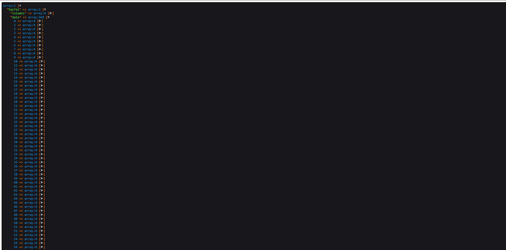

# Linux


---
# Angaryos Genel Mantığı
**Genel amaçlı yazılım angaryalarından kurtarmak üzere hazırlanmış bir framework'tür angaryos.**

Başlık ve açıklama kısmı düzenlenecektir.


---

## Framwork Hakkında Öğrenilen Bilgiler.
- #### Tablo yapısı
- #### Kolonlar.

---
### Tablo Yapısı

Framework'u aslında herşeyini dizi veya json olarak nitelendirebilirsiniz. Yazılım dilinde eğer birşeyi dinamik hale getirmek istiyorsanız çoğu şeyin başında diziler gelecektir.

Örnek bir senaryoda çok ufak çaplı bir web sitesinin oluşacağı veritabanı tabloları şunlardan ibarettir. 

| Tablo Adı | Açıklama |
| ----------- | ----------- |
| Settings | Ayar kısmı |
| Products | Ürünler kısmı |
| Gallery | Galeri kısmı |

> Buraları anlaşılabilir olması açısından sade ve kısa tutuyorum.

Bu senaryoda sabit tablolarımız var sitemizin arka planında düzenleyebilceğimiz ve veritabanında tutabileceğimiz bilgiler 3 adet tablodan oluşmakta. 
Bu tabloları çoğaltmak istediğimizde naparız ? Bir sql kodu yazıp create yaparız yada bir phpmyadmin,pgadmin vs... tarzı yönetim araçlarıyla tablo oluştururuz değil mi ? Aslında frameworkumuzdede yapacağımız şey aynısı sadece alışılagelmişin dışında bir veritabanı yönetim aracı olması.
  >Tabiki herşey bu aşamada bu kadar gözükecektir. 

Peki ben bu tabloları bir dizide tutsaydım ve şu hali alsaydı. 
```
array(
 "0" => "Settings",
 "1" => "Products",
 "2" => "Gallerry"
)
```

Peki bu listeye yeni bir tablo eklemek istediğinizde yapmanız gereken şey nedir ? tabiki diziye yeni bir eleman eklemek. Tamam bu diziye eleman ekledik ama altta çalışan mekanizma nedir ? 

Sql create kodu . Dizinin her elemanını foreach ile dönüp teker teker bu tabloları oluşturacaktır...

---


### Kolonlar
Products tablosunu ele alıcak olursak. 
| id | name | category |  price | image_url |
| ----------- | ----------- | ----------- | ----------- | ----------- |
| 1 | abc | abc | 11 | 1.png | 

Şeklinde bir tablomuz olduğunu varsayarsak bunu oluştururken create komutunun içerisinde bizim kolonlarımızı belirtmezmiyiz. Peki bunlarıda dizi haline dönüştürüp backendden gelen veriyi create fonksiyonuna yazsaydık. 

Easy phpmyadmin.... ;) 


---


### Helpers Kullanımı

- **onload Helpers**
- **custom Helpers**

#### Onload Helpers

`backend/app/helpers.php`

Sayfa yüklendiğinde aktif olan helpers'lar burada yer alır. bu helpersları istediğiniz sayfada mvc mantığındaki helperslar gibi kullanabilirsiniz

#### Custom helpers
`bakcend/app/HelperFunctions`
içerisinde kendi yazmış olduğunuz custom helpers'lar bulunmaktadır. bunlar excel'den veri okuma gibi spesifik işlerde işinize yarayacak ancak her sayfa yüklenişinde hızınızı yavaşlatacak helperlardır.


#### Custom Helpers kullanımı

> eğer helpers.php'ye bakacak olursanız helper adında bir fonksiyon göreceksiniz. bu fonksiyon içerisine aldığı ilk parametreyi replace ederek bizim HelperFunction klasöründe alarar ve include eder. yani ilk parametrede gönderdiğiniz HelperFunction içine yazdığınız helper'ı kullanabilir hale gelirsiniz. 2. parametre ise custom helper'ınıze göndereceğiniz parametredir bu excel örneğinde dosya yolu olabilir. 

Gelin beraber excel örneğine bakalım HelperFunction klasörünün içerisinde 
*get_data_from_excel_file* adlı helper'im mevcut bunu kullanırken şunu yapmamız yeterli 

``` helper('get_data_from_excel_file', '/var/www/public/genclik.xlsx');```

1. parametre **HelperFunction** içerisinde bulunan helper dosyamızın yolu 2.si ise excel helper'i olduğu için public klasörüne attığımız excel dosyası. isterseniz birde görsel ile zenginleştirelim.

``` 
        $data = helper('get_data_from_excel_file', '/var/www/public/genclik.xlsx');

        dd($data);
```

çıktısına göz atalım. 




herhangi bir excelde bulunan datayı bu şekilde aktarıp kullanabilirsiniz.


### Kurulumda Karşılaşılanlar

---
**Veritabanı başlamaması**
İçerideki datalar oluşmamış olacağından seeder işlemi yapmanız gerekir 

```https://url:9000 ```

portundan erişebileceğiniz portainer bulunmkatadır.

> Portainer için ayrıca bakınız(Docker)

Buradan laravel container'ını bulup bash'e girmeniz gerekiyor. Bu işlemi işletim sisteminize ssh bağlantısı yaparak container'ınızın bash'ıne girmeniz mümkün buda sizin docker kullanımınıza kalmış bir durumdur.

Laravel bash'inde 

```php artisan db:seed ```

komutunuzu çalıştırın.

Seed işlemi laravelin bir komutudur farkettiğiniz üzere artisan ile tetiklenmekte. Laravel üzerinde seeder'lar veritabanı oluşturduğu esnada içeri örnek datalar basmaktadır. 

***!!! Bütün datalarınızı sileceği için çalışan sistemde denemeyiniz.***

---
**Postgres İzinleri**
postgresql 777 izinlerine sahip değil bundan dolayı hata aldım. postgres klasörünün izinlerini değiştirmeyin değiştirirseniz silip docker'ın tekrar yüklemesini bekleyin.

---
**Log Hatası**

 Eğer küçük bir sunucuda çalışıyorsanız rabbitmq elasticsearch kapatmanız gerekecektir.
Fremawork buralara hata yazmak istediğinden dolayı messagelibrary hatasıyla karşılaşacaksınız. bu hatayı yakalamak içinde. GeneralController içindeki apiden test alınız. aldıgınız testte https://url/api/v1/public/test urlinden kontrol edebilirsiniz. burası GeneralController içindeki test fonksiyonunda yer alan kodları size gösterecektir. burada error handlingi aktif etmek için 
  ```
    ini_set('display_errors', 1);
    ini_set('display_startup_errors', 1);
    error_reporting(E_ALL);
  ```
kodlarını kullanabilirsiniz. 

MessageLibrary içerisinde aldığınız hata 130. satırları işaret ettiğinde yapıcağınız işlem

.env içerisindeki 
```
LOG_CHANNEL=daily 
```

olarak düzeltmektir.


### Custom Kodlar


 - örnek bir senaryomuzda. Bir tablomuzun bir kolonunda dizi halinde tuttuğunuz bir dizi var ve bunlarda belirli kullanıcıların idleri olsun. 

---
 **Gerçek hayat**
 - Kurumlara eğitim veren bir iş yapıyorsunuz ve kurumlar'ın çalışanları kullanıcılar tablonuzda kayıtlı olsun
 - Açacağınız eğitim tablosunda bir kolonda personellerin id'lerini tutacak ve eğitimi buradan takip edeceksiniz. 
 - Bir tablodaki bir özelliğe göre diğer kolonu update etme işlevi aşağıdaki gibidir.

---
**Step 1**

 ```
        $n = \Carbon\Carbon::now();

 ```
 komutuyla önce bir laravel'den tarihimizi isteyelim çünkü her tablo için updated_at kolonu siz oluşturmasanızda otomatik oluşacaktır.
 
---
**Step 2**

 Daha sonra tablomuzu bir çekelim
        ```$grup = DB::table('kullanici_gruplari')->where('id',145)->get();        ```
Burada kullanici_gruplari tablosundan id'si 145 olan kaydımızı $grup değişkenine atadık ileride işlev göreceğiz. 

Daha sonra a firmasının kullanıcılarını bu gruplar tablosundaki personel id kolonuna eklemek istiyorsunuz bunun için user tablosundan kurumun kayıtlarını alalım.

       ``` $user = DB::table('users')->where('kurum_id', 23)->get(); ```     
user tablosunda ki kurum_id'si 23 olan kullanıcıları aldık.

---
**Step 3**

boş bir id dizisi oluşturuyorum ve datalarımı şu  şekle çevirmek için string casting uygulayacağım 

**["123","123","123"]**

ve grup değişkenindeki tüm datayı gezerek ids dizisine ekleme yapacağım daha sonra dizimi json haline çevireceğim

``` 
   foreach ($gr as $key => $value) {
            array_push($ids, (string)$value->id);
        }
        $jsn= json_encode($ids);

```
ids dizimiz artık bu formattadır 
*["123","123","123"]*


---
**Step 4**
Artık güncelleme işlemini gerçekleştirebiliriz.
Güncellememiz gereken 3 kolon bulunmakta 

- personel_ids
- user_id
- updated_at

bunlar tabiki sizin tablonuza göre değişiklik gösterecektir ancak bizim senaryomuzda bu şekilde güncelleme işi için laravelin sabit fonksiyonunu kullanacağız bir güncelleme yapacağımız diziyi göndermemiz yeterli


```
     $update =
                     [
                          'personel_ids' => $jsn,
                          'user_id' => ROBOT_USER_ID,/
                          'updated_at' => $n
                      ];
        
                      DB::table('kullanici_gruplari')->where('id', 54)->update($update);
```


Tüm kodları şu şekilde görebilirsiniz.


```

  $n = \Carbon\Carbon::now();
        $grup = DB::table('kullanici_gruplari')->where('id',54)->get();        
          //gelen verileri stringe cast edip json string  haline gelmesini sağlıyoruz.
        $gr = DB::table('users')->where('kurum_id', 23)->get();
        $ids = [];
        foreach ($tapu as $key => $value) {
            array_push($ids, (string)$value->id);
        }
        $jsn= json_encode($ids);
        $update =
                     [
                          'personel_ids' => $jsn,
                          'user_id' => ROBOT_USER_ID,/
                          'updated_at' => $n
                      ];
        
                      DB::table('kullanici_gruplari')->where('id', 54)->update($update);
        
        dd($jsn);


```


---
#### Excel dosyasından kullanıcı gruplarına

**Açıklama Eklenecektir**
```
        $n = \Carbon\Carbon::now();
        $kontrol = DB::table('kullanici_gruplari')->where('id','53')->get();
        $data = helper('get_data_from_excel_file', '/var/www/public/genc.xlsx');
        $dataa = $data['Sayfa1']['data'];
        $ids = [];

        foreach ($dataa as $key => $value) {
            if($value['T.C']!==null){
            array_push($ids, trim((string)$value['T.C']));
            }
        }
        $personelId = [];
        $genclikUserControl = DB::table('users')->where('kurum_id', '12')->get();
        foreach($genclikUserControl as $item){
            if(in_array($item->tc,$ids)){
              array_push($personelId, trim((string)$item->id));
            }
        }
        $personelIdjs = json_encode($personelId);
            $update =
                     [
                         'personel_ids' => $personelIdjs,
                         'user_id' => ROBOT_USER_ID,
                         'updated_at' => $n
                     ];
        
                     DB::table('kullanici_gruplari')->where('id', 53)->update($update);
             


    


        dd($personelIdjs);


```

---
# Windows

Windows'da angaryosu kullanabilmeniz için wsl ve docker kurmanız gerekiyor bunlar için ayrıca bknz [wsl](https://www.windowscentral.com/install-windows-subsystem-linux-windows-10) [docker](https://docs.docker.com/docker-for-windows/install/)

Kurduktan sonra bir adet ubuntu'yu mağazınızdan indirerek işlemlere başlayabilirsiniz. İleride ihtiyacınız olabilicek faydalı bir link openssh linkini bırakıyorum [openssh](https://www.illuminiastudios.com/dev-diaries/ssh-on-windows-subsystem-for-linux/)


---
**Angaryos kurulumu**

Aslında bu iki bileşeni kurduktan sonra linux bir makineye sahip olduğunuz için linux komutlarının aynıları kullanılabilir. 

*Faydalı komutlar* 
``` 
ip addr /* ip  adresinizi öğrenmek için
chmod -R 777 ./angaryos-stack/backend/.env
chmod -R 777 ./angaryos-stack/frontend/src/environments/environments.prod.ts
chmod -R 777 ./angaryos-stack/frontend/src/environments/environments.ts
 ```
 - ip adresinizi eth0 altından öğrenebilirsiniz ve diğer satırlara okuma yazma izni verip vscode ile bağlanabilirsiniz tabiki bir [openssh](https://www.illuminiastudios.com/dev-diaries/ssh-on-windows-subsystem-for-linux/) bağlantısına ihtiyaç duyacaksınız. 
 
 - Ubuntu penceremizden gerekli klasörlere giderek 
 - - .env'de
 - - - APP_URL 
 - - environments.prod.ts && environments.ts'de 
 - - - host

 kısımlarını kendi ipnize configüre edebilirsiniz.

 - Portainer (9000 portunda) kullanıp yada docker container'ınızdan laravel cli'na girip php artisan db:seed yapmayı unutmayın!

https://ipadresiniz'den angaryos'a erişebilirsiniz.


---